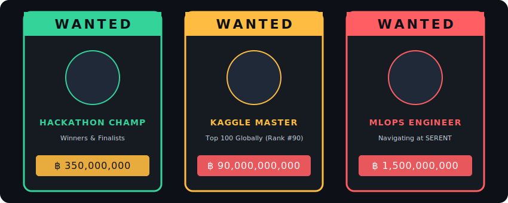
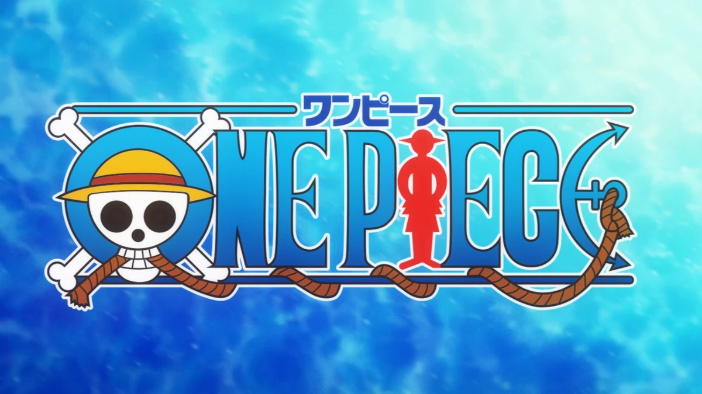

<!-- Header Banner (Reference to assets/header.svg) -->

  

<!-- Dynamic Typing SVG & Visitor Counter -->

  

  
  &nbsp;&nbsp;&nbsp;&nbsp;
  
  
  
  

---

## 🏴‍☠️ The Captain's Log (About Me)

<blockquote>
  <table>
    <tr valign="middle">
      <td>
        
      </td>
      <td>
        
      </td>
    </tr>
  </table>
</blockquote>

<table width="100%">
  <tr>
    <td width="65%" valign="top">
      
Ahoy! ⛵ I am <b>Anurag Raj</b>, an <b>MLOps & AI Platform Engineer</b> currently embarking on my next big voyage: joining <b>SERENT</b> as an MLOps Engineer. Just like navigating the unpredictable waters of the Grand Line, I design, automate, and monitor production-ready machine learning architectures that scale and survive under any condition.

      <ul>
        <li>👑 <b>Kaggle Notebook Master (Rank #90 Globally):</b> Actively building and optimizing ML models, EDA pipelines, and deep learning notebooks.</li>
        <li>🤖 <b>Swarm & Multi-Agent systems:</b> Specialized in agentic workflows with the OpenAI Agents SDK, LangGraph, and Model Context Protocol (MCP).</li>
        <li>🧬 <b>RAG / Semantic Architectures:</b> Experienced in structuring dense/sparse vector search, metadata SQL pre-filtering, and graph retrieval pipelines using ChromaDB, Neo4j, and LlamaIndex.</li>
        <li>🐳 <b>MLOps Infrastructure:</b> Creating automated, reproducible pipelines using Docker, DVC, Airflow, MLflow, Langfuse, and Terraform deployed serverless on AWS and GCP.</li>
      </ul>
    </td>
    <td width="35%" align="center" valign="middle">
      <!-- Straw Hat Theme Representation -->
      
        
      <b>Crew's Navigation Tools</b>
    </td>
  </tr>
</table>

---

## 🗺️ The Grand Line: MLOps Career Voyage

Here is the roadmap of my journey, mapping my professional progression in a zig-zag path from a student to my current role as an MLOps Engineer at SERENT:

<!-- Custom Vector Zig-Zag Career Voyage Map (Reference to assets/voyage-map.svg) -->

  

---

## 🛠️ Arsenal of Weapons (Skills & Tools)

<table width="100%">
  <tr>
    <td width="50%" valign="top">
      <h3>🧠 Machine Learning & LLM Orchestration</h3>
      

        
        
        
        
        
        
        
        
      

      <h3>💾 RAG Databases & Knowledge Graphs</h3>
      

        
        
        
        
        
      

    </td>
    <td width="50%" valign="top">
      <h3>🚀 MLOps, CI/CD & Infrastructure</h3>
      

        
        
        
        
        
        
        
        
      

      <h3>☁️ Cloud & Development Environments</h3>
      

        
        
        
        
      

    </td>
  </tr>
</table>

---

## 🥇 Kaggle Masterpieces

As a **Top 100 Kaggle Notebook Master (Global Rank #90)**, here are some of my highly recognized works:

<table width="100%">
  <tr>
    <td width="33%" valign="top">
      <h4>🎯 <a href="https://www.kaggle.com/code/anuragraj03/ppe-detection-using-yolo-helmet-vest-others">PPE Detection (YOLO)</a></h4>
      
End-to-end computer vision pipeline using YOLO to detect safety equipment (helmets, vests, etc.) with high precision and low inference latency.

      

         
        
      

    </td>
    <td width="33%" valign="top">
      <h4>🐱🐶 <a href="https://www.kaggle.com/code/anuragraj03/cat-vs-dog">Cat vs Dog Classification</a></h4>
      
Deep Learning CNN architecture designed and trained to classify cat and dog images, comparing performance across various transfer learning backbones.

      

         
        
      

    </td>
    <td width="34%" valign="top">
      <h4>🎵 <a href="https://www.kaggle.com/code/anuragraj03/eda-on-the-spotify-dataset">Spotify Dataset EDA</a></h4>
      
Comprehensive exploratory data analysis and feature engineering pipeline on Spotify audio features to uncover acoustic trends and artist correlations.

      

         
        
      

    </td>
  </tr>
</table>

---

## 🏆 Featured Projects

<table width="100%">
  <!-- Project Row 1 -->
  <tr>
    <td width="50%" valign="top">
       
      
        
      
Autonomous multi-agent system built on the OpenAI Agents SDK that routes requests, synthesizes knowledge, and writes its own tools dynamically.

      <ul>
        <li><b>Background Synthesizer (ASSE):</b> Analyzes user dialogue and generates reusable Markdown tools and Python scripts.</li>
        <li><b>Two-tier Semantic Cache:</b> Persists embeddings in SQLite to prevent redundant API calls.</li>
        <li><b>Observability:</b> MLflow tracking and Langfuse integration.</li>
      </ul>
      

        
        
        
      

    </td>
    <td width="50%" valign="top">
       
      
        
      
FastAPI inference service for clinical text assertion negation, optimized for instant, serverless execution on Google Cloud Run.

      <ul>
        <li><b>⚡ Sub-500ms Cold Starts:</b> Hugging Face model weights baked directly into container layers during build.</li>
        <li><b>🧠 Singletion Lifespan:</b> Model loaded once into RAM, keeping predictions under 250ms.</li>
        <li><b>🔒 Release-Driven CD:</b> CI runs Pytest/Flake8; CD triggers strictly on semver tags (<code>v*.*.*</code>) to deploy to GCP.</li>
      </ul>
      

        
        
        
      

    </td>
  </tr>
  
  <!-- Project Row 2 -->
  <tr>
    <td width="50%" valign="top">
       
      
        
      
Full-fledged LLMOps platform integrating retrieval pipelines, multi-agent evaluation, and persistent dashboards.

      <ul>
        <li><b>LangGraph Swarm:</b> Structured supervisor-worker agent framework containing retrievers, summarizers, and evaluators.</li>
        <li><b>Hybrid Retrieval:</b> Combined metadata pre-filtering (NLP-to-SQL) with BM25 + FAISS + cross-encoder reranker.</li>
        <li><b>Storage:</b> DVC Ingestion pipeline pushing embeddings and metadata to AWS S3.</li>
      </ul>
      

        
        
        
      

    </td>
    <td width="50%" valign="top">
       
      
        
      
End-to-end computer vision MLOps project classifying hand gestures and deployed with automatic CI/CD workflows.

      <ul>
        <li><b>MobileNetV2:</b> Achieved 98% accuracy on gesture classifications.</li>
        <li><b>Airflow + DVC:</b> Automatic model retraining based on drift detection checks.</li>
        <li><b>Observability:</b> Prometheus metrics + Grafana monitoring dashboard tracking drift.</li>
      </ul>
      

        
        
        
      

    </td>
  </tr>
</table>

---

## 📜 Professional Experience Verifications

Here are the credentials from my professional internships as an MLOps & Machine Learning Intern:

<table width="100%">
  <tr>
    <td width="33%" align="center" valign="top">
      
        
       
      RAG & Multi-Agent systems
    </td>
    <td width="33%" align="center" valign="top">
      
        
       
      Docker pipelines & CVAT PPE
    </td>
    <td width="34%" align="center" valign="top">
      
        
       
      Recommenders & Price Elasticity
    </td>
  </tr>
</table>

---

## 🏆 Achievements & Pirate Bounties

<!-- Custom Styled Wanted Poster Board (Reference to assets/bounties.svg) -->

  

 

<table width="100%">
  <tr>
    <td width="50%" align="center">
      
    </td>
    <td width="50%" align="center">
      
    </td>
  </tr>
</table>

---

## ⚓ The Snake Game of Contribution

  <!-- Note: This image will display a broken link until you run the Generate Snake Animation workflow in your repository for the first time! -->
  

---

## 🐌 Den Den Mushi Broadcasts (Quotes & Inspirations)

  

---

<!-- Centered One Piece Anime Logo Signature with Typing Animation Subtitle -->

  
    
  

  Let's connect and build the next generation of AI Platforms! 🚀

